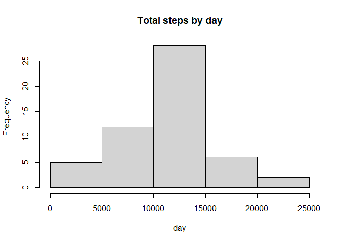
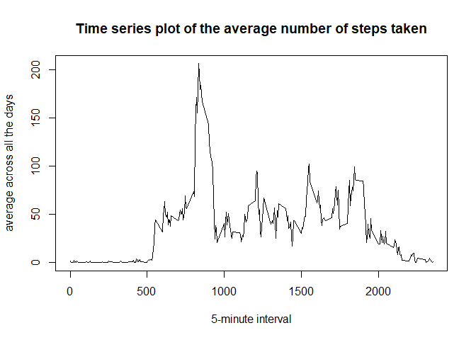
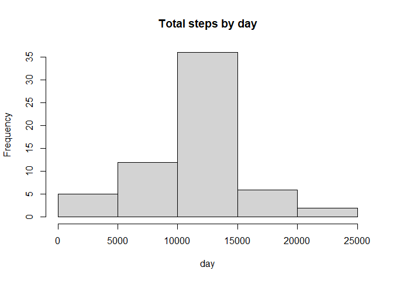
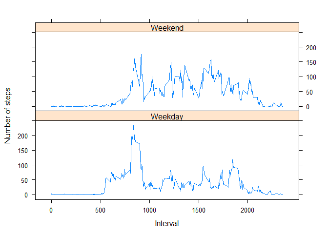

## Loading and preprocessing the data

```r
activity <- read.csv("activity/activity.csv", colClasses = c("numeric", "character", 
    "numeric"))
head(activity)
```

```
##   steps       date interval
## 1    NA 2012-10-01        0
## 2    NA 2012-10-01        5
## 3    NA 2012-10-01       10
## 4    NA 2012-10-01       15
## 5    NA 2012-10-01       20
## 6    NA 2012-10-01       25
```

Load lattice library for plotting


```r
library(lattice)
```
Cast dates to year-month-day


```r
activity$date <- as.Date(activity$date,format="%Y-%m-%d")
```

```
## Warning in strptime(x, format, tz = "GMT"): unable to identify current timezone 'C':
## please set environment variable 'TZ'
```

```r
head(activity)
```

```
##   steps       date interval
## 1    NA 2012-10-01        0
## 2    NA 2012-10-01        5
## 3    NA 2012-10-01       10
## 4    NA 2012-10-01       15
## 5    NA 2012-10-01       20
## 6    NA 2012-10-01       25
```

## What is mean total number of steps taken per day?
First get the total steps per day using the aggregate function


```r
total <- aggregate(steps ~ date,data = activity,sum,na.rm=TRUE)
```

Plot the histogram showing the totals per day


```r
hist(total$steps, main = "Total steps by day", xlab = "day")
```

<!-- -->

The mean is calculated as follows:


```r
mean(total$steps)
```

```
## [1] 10766.19
```

The median is calculated as follows:


```r
median(total$steps)
```

```
## [1] 10765
```


## What is the average daily activity pattern?
To get the time series, first we will use the following to group the data:


```r
series <- tapply(activity$steps, activity$interval, mean, na.rm = TRUE)
```

Then we plot the plot as shown below:


```r
plot(row.names(series), series, type = "l", xlab = "5-minute interval", ylab = "average across all the days", main = "Time series plot of the average number of steps taken")
```

<!-- -->

The 5-minute interval that, on average, contains the maximum number of steps:


```r
max <- which.max(series)
names(max)
```

```
## [1] "835"
```


## Imputing missing values
This section describes the code used to impute the missing values

First, fetch all the missing values:


```r
actNA <- sum(is.na(activity))
```

The number of missing values are:


```r
actNA
```

```
## [1] 2304
```

To impute the missing values, we will use the mean:


```r
average <- aggregate(steps ~ interval, activity,mean)
fillNA <- numeric()
for (i in 1:nrow(activity)) {
    obs <- activity[i, ]
    if (is.na(obs$steps)) {
        steps <- subset(average, interval == obs$interval)$steps
    } else {
        steps <- obs$steps
    }
    fillNA <- c(fillNA, steps)
}
```

Make a copy of the activity field and fill the missing with the mean:


```r
activity_1 <- activity
activity_1$steps <- fillNA
```

Histogram of the total number of steps taken each day after missing values are imputed:


```r
total_1 <- aggregate(steps ~ date, activity_1, sum, na.rm = TRUE)
hist(total_1$steps, main = "Total steps by day", xlab = "day")
```

<!-- -->

## Are there differences in activity patterns between weekdays and weekends?
We use the weekdays function here:


```r
weekday <- weekdays(activity$date)
day_type <- vector()
for (i in 1:nrow(activity)) {
    if (weekday[i] == "Saturday") {
        day_type[i] <- "Weekend"
    } else if (weekday[i] == "Sunday") {
        day_type[i] <- "Weekend"
    } else {
        day_type[i] <- "Weekday"
    }
}
```

Set the day type on the data frame:


```r
activity$day_type <- day_type
activity$day_type <- factor(activity$day_type)

per_day_steps <- aggregate(steps ~ interval + day_type, activity, mean)
names(per_day_steps) <- c("interval", "day_type", "steps")
```

Panel plot comparing the average number of steps taken per 5-minute interval across weekdays and weekends:


```r
xyplot(steps ~ interval | day_type, per_day_steps, type = "l", layout = c(1, 2),        xlab = "Interval", ylab = "Number of steps")
```

<!-- -->

